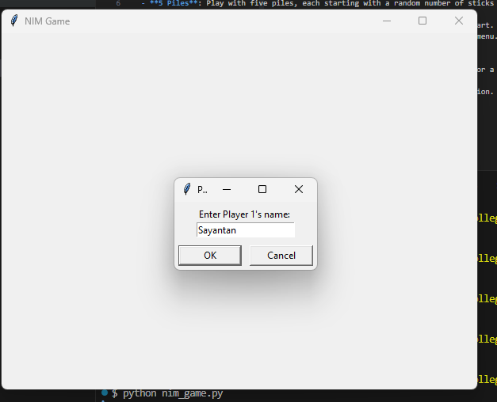
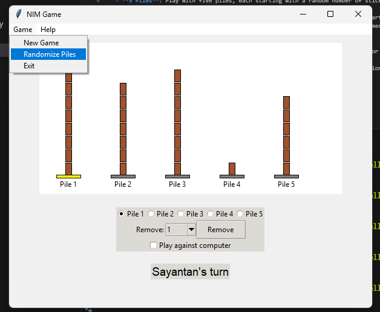
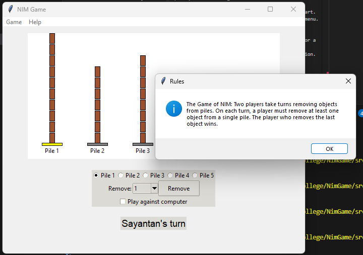
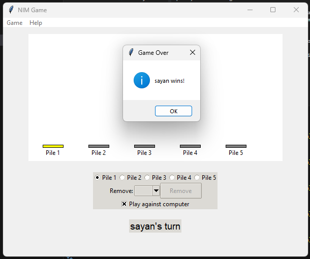

# NIM Game

A Python-based implementation of the classic mathematical strategy game NIM, built with Tkinter for a graphical user interface. This version features 5 piles of objects (sticks), a real-life-like design with customizable player names, an option to randomize pile sizes, and an optional AI opponent.

# NIM Game

---

### Introduction

The[ **Overview** ]  
The NIM Game is a classic mathematical strategy game where two players alternate removing objects from distinct piles. The goal is to be the player who removes the last object, requiring careful strategy and foresight. This Python-based implementation elevates the experience with a modern Tkinter graphical interface, featuring:  
- **5 Piles**: Engaging gameplay with five distinct piles.  
- **Customizable Names**: Players can personalize their experience by entering their names.  
- **Randomized Piles**: Option to start with random pile sizes for variety.  
Designed for Python 3.13.2 on Windows, this version combines tradition with a visually appealing, user-friendly design.

---

### Foreword

**[ **Project Evolution** ]**  
What started as a basic coding exercise grew into a sophisticated application through iterative refinement and a focus on blending functionality with aesthetics. Built for Python 3.13.2 on Windows, this NIM Game balances simplicity and engagement, appealing to both casual players and strategy enthusiasts. It offers a digital take on a historic game, enhanced by modern features and a polished interface.

---

### Acknowledgement

**[ **Gratitude** ]**  
This project owes much to the Python community for tools like Tkinter, enabling robust GUI development. Special appreciation goes to those whose feedback drove key enhancements—expanding to 5 piles, adding randomization, and crafting real-life-like visuals. Their contributions highlight the value of collaboration in creating an enjoyable and effective game.

---

### Objective

**[ **Purpose** ]**  
The NIM Game aims to provide an entertaining and strategic experience, allowing players to challenge each other or an AI opponent. It preserves the core of NIM—strategic object removal to outsmart the opponent—while introducing modern elements like:  
- A graphical UI for intuitive play.  
- Custom player names for a personal touch.  
- Flexible pile configurations for replayability.  
The goal is a fun, accessible game that feels both timeless and innovative.

---

## Features
- **5 Piles**: Play with five piles, each starting with a random number of sticks (1-10).
- **Custom Player Names**: Enter your name and your opponent's name at the start.
- **Randomize Piles**: Option to start with random pile sizes via the "Game" menu.
- **AI Opponent**: Toggle "Play against computer" to face a random-move AI as Player 2.
- **Visual Design**: Stacks of brown sticks on bases (yellow when selected) for a clean, real-life feel.
- **User-Friendly UI**: Modern `ttk` widgets with a menu bar for easy navigation.

## Folder Structure
```
NimGamePython/
├── images/
├── src/
│   ├── game_logic.py
│   └── nim_game.py
└── run.bat
```

## Prerequisites
- **Python 3.13.2**: Installed and accessible via `python --version` (confirmed on your system).
- **Tkinter**: Included with Python 3.13.2 on Windows; no separate installation needed.

## Setup Instructions
1. **Navigate to Project Directory**:
```
mkdir NimGamePython
cd NimGamePython
```


2. **Create `src` Directory**:
- Inside `NimGamePython`:
```
mkdir src
```

3. **Add Source Files**:
- **game_logic.py**: Create and paste the code from earlier instructions into `src\game_logic.py` using Notepad (`notepad src\game_logic.py`).
- **nim_game.py**: Create and paste the code from earlier instructions into `src\nim_game.py` using Notepad (`notepad src\nim_game.py`).

4. **Add `run.bat`**:
- Create `run.bat` in `NimGamePython`:
```
notepad run.bat
```
- Paste:
```
@echo off
python src\nim_game.py
```
- Save and close.

## How to Run
1. **Open Command Prompt**:
- cd to the correct directory
```
\NimGamePython
```

2. **Run the Game**:
- Via batch file:
```
run.bat
```
- Or directly:
```
python src\nim_game.py
"or"
cd sec/ "and after that" python nim_game.py
```


3. **Play**:
- Enter player names when prompted.
- The game window opens with 5 piles of sticks.

## Gameplay
- **Objective**: Remove the last stick to win.
- **Turn**: Select a pile (base turns yellow), choose a number from the dropdown, and click "Remove".
- **AI Mode**: Check "Play against computer" for AI moves after your turn.
- **Menu**:
- **Game > New Game**: Restart with the same pile sizes.
- **Game > Randomize Piles**: Start with new random sizes.
- **Game > Exit**: Close the game.
- **Help > Rules**: View game rules.

## Troubleshooting
- **Python Not Found**:
- Verify: `python --version` shows `Python 3.13.2`.
- If missing, add Python to PATH via `Control Panel > System > Advanced system settings > Environment Variables > Path`.
- **File Not Found**:
- Check `dir` and `dir src` to confirm files exist.
- **Tkinter Error**:
- Reinstall Python with "tcl/tk and IDLE" checked if `import tkinter` fails.
- **Errors**:
- Run `python src\nim_game.py` and note any error messages for debugging.

## Notes
- Built for Windows with Python 3.13.2 at `C:\Users\yourPC`.
- Expandable with additional features like adjustable pile counts or smarter AI—suggest improvements if desired!





